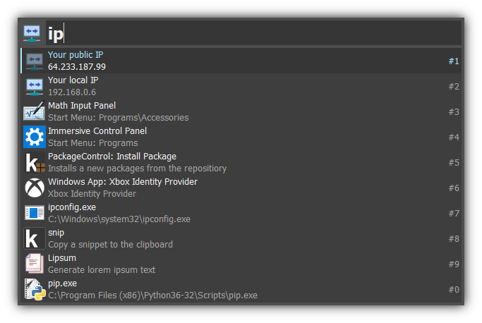

  

# Keypirinha Plugin: MyIP

This is MyIP, a plugin for the
[Keypirinha](http://keypirinha.com) launcher.

Get your public and local IP directly from Keypirinha.

## Download
https://github.com/Fuhrmann/keypirinha-myip/releases/latest

## Install

#### Managed
[@ueffel](https://github.com/ueffel) wrote [PackageControl](https://github.com/ueffel/Keypirinha-PackageControl), a package manager that eases the install of third-party packages.
It must be installed manually.

#### Manual
Once the `MyIP.keypirinha-package` file is installed,
move it to the `InstalledPackage` folder located at:

* `Keypirinha\portable\Profile\InstalledPackages` in **Portable mode**
* **Or** `%APPDATA%\Keypirinha\InstalledPackages` in **Installed mode** (the
  final path would look like
  `C:\Users\%USERNAME%\AppData\Roaming\Keypirinha\InstalledPackages`)

## Usage

Open Keypirinha and type 'ip' or 'IP'. Your local and public IP will appear on Keypirinha's catalog. Press `ENTER` to copy.

## Change Log
### v1.0
* Released

## License
This package is distributed under the terms of the MIT license.

## Credits
The icon used in this plugin was provided by [icons8](https://icons8.com)
